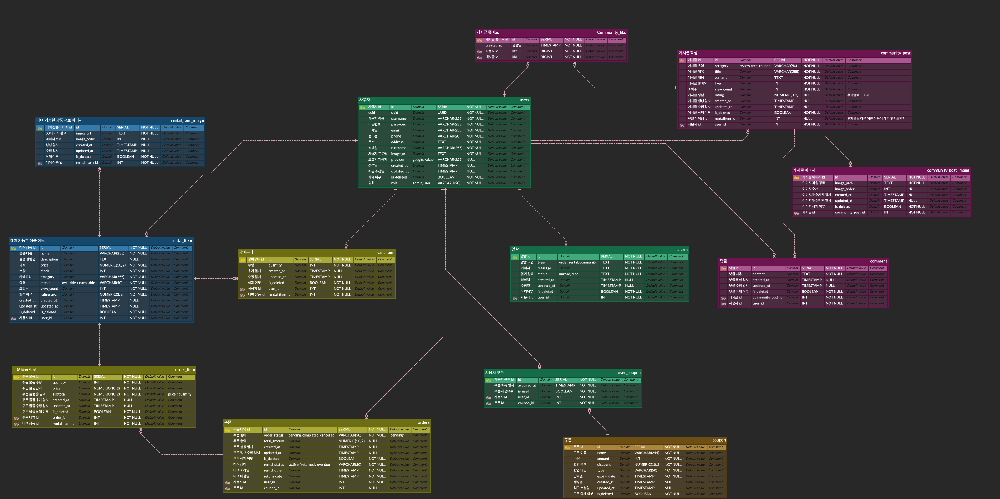

<body style="font-family: Arial, sans-serif; line-height: 1.6; margin: 20px; color: #333;">

<h1 style="color: #333; font-size: 2em;">📌 렌탈 서비스 백엔드 프로젝트 📌</h1>

이 백엔드 프로젝트는 렌탈 서비스 플랫폼을 지원하기 위해 설계되었으며, 사용자 관리, 대여 아이템 관리, 주문 처리 및 커뮤니티 상호작용 등의 다양한 기능을 제공합니다.

<h2 style="color: #0056b3; border-bottom: 2px solid #ddd; padding-bottom: 5px;">⚙️ 프로젝트 설정</h2>

<h3 style="color: #333;">1. 필수 조건</h3>
<ul>
    <li>Java 17 (프로젝트 도구 체인에 설정됨)</li>
    <li>Spring Boot 3.3.5</li>
    <li>PostgreSQL 데이터베이스</li>
</ul>

<h3 style="color: #333;">2. 빌드 및 실행</h3>
<pre><code>./gradlew bootRun</code></pre>

이 명령어를 사용해 애플리케이션을 시작할 수 있습니다. PostgreSQL이 실행 중이며 접근 가능한 상태인지 확인하십시오.

<h2 style="color: #0056b3; border-bottom: 2px solid #ddd; padding-bottom: 5px;">📦 종속성</h2>
<ul>
    <li><strong>Spring Boot 스타터:</strong> Actuator, Data JPA, Web</li>
    <li><strong>데이터베이스:</strong> PostgreSQL 드라이버</li>
    <li><strong>QueryDSL:</strong> QueryDSL JPA (복잡한 쿼리용)</li>
    <li><strong>로깅:</strong> P6Spy (SQL 로깅)</li>
    <li><strong>모니터링:</strong> Micrometer with Prometheus</li>
    <li><strong>문서화:</strong> Springdoc OpenAPI</li>
</ul>

<h2 style="color: #0056b3; border-bottom: 2px solid #ddd; padding-bottom: 5px;">🚀 애플리케이션 구조</h2>
<ul>
    <li><strong>도메인:</strong> <code>User</code>, <code>RentalItem</code>, <code>Order</code>, <code>CommunityPost</code> 등의 주요 엔티티를 포함합니다.</li>
    <li><strong>레포지토리:</strong> 데이터베이스와 상호작용하는 데이터 접근 계층입니다.</li>
    <li><strong>서비스:</strong> 비즈니스 로직을 구현합니다.</li>
    <li><strong>컨트롤러:</strong> 프론트엔드에 노출되는 API 엔드포인트입니다.</li>
</ul>

<h3 style="color: #333;">데이터베이스 스키마</h3>

이 스키마에는 사용자 관리, 아이템 대여, 주문 처리 및 커뮤니티 상호작용과 같은 다양한 플랫폼 기능을 지원하는 <code>users</code>, <code>rental_item</code>, <code>orders</code>, <code>community_post</code> 등의 테이블이 포함되어 있습니다.

<h2 style="color: #0056b3; border-bottom: 2px solid #ddd; padding-bottom: 5px;">🌐 API 문서</h2>

API 문서는 <strong>Springdoc OpenAPI</strong>를 사용해 생성되며 애플리케이션 실행 후 <code>/swagger-ui.html</code>에서 확인할 수 있습니다.

<h2 style="color: #0056b3; border-bottom: 2px solid #ddd; padding-bottom: 5px;">🧪 테스트</h2>
<ul>
    <li><strong>JUnit 5:</strong> 각 서비스와 컨트롤러 레이어에 대한 유닛 및 통합 테스트를 제공합니다.</li>
    <li><strong>Testcontainers:</strong> PostgreSQL Testcontainer를 사용하여 독립적인 데이터베이스 테스트 환경을 구성합니다.</li>
</ul>

<h2 style="color: #0056b3; border-bottom: 2px solid #ddd; padding-bottom: 5px;">🔐 보안 (선택 사항)</h2>

보안 종속성은 미리 구성되어 있으나 현재는 주석 처리되어 있습니다. <code>build.gradle</code> 파일에서 주석을 해제하여 추가적인 보안 계층을 활성화할 수 있습니다.

<h2 style="color: #0056b3; border-bottom: 2px solid #ddd; padding-bottom: 5px;">📝 추가 정보</h2>
<ul>
    <li>데이터베이스 설정을 위한 환경 변수가 제대로 설정되어 있는지 확인하십시오.</li>
    <li>각 서비스나 API의 상세 사용법과 응답 구조는 Swagger UI를 통해 참조할 수 있습니다.</li>
</ul>

<h3 style="color: #333;">프로젝트 구성 세부 사항</h3>

프로젝트는 라이브러리 간의 호환성을 위해 Spring Boot의 종속성 관리를 사용합니다. 다양한 환경을 효과적으로 관리할 수 있는 구성 옵션이 제공됩니다.

각 엔티티에 대한 추가 세부 사항은 스키마 문서나 Swagger UI에서 제공되는 API 사양을 통해 확인할 수 있습니다.

